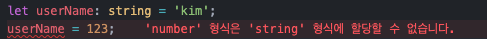
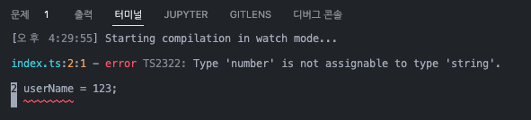
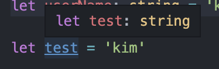
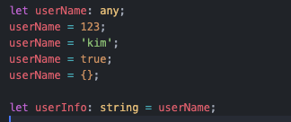
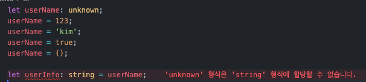
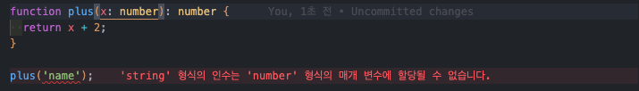

# 타입스크립트 study

타입스크립트 공부하기 2022 10 20 start!
<br>
<br>

# 📌 타입스크립트 설치하기

`npm install -g typescript`

\*맥북의 경우 보안에러가 뜨면 `sudo npm install ~`

웹브라우저는 ts파일을 알아듣지 못해 js파일로 변환 작업을 해야한다.

Terminal에 `tsc -w` 입력해두면 자동으로 ts파일을 js파일로 변환해줌

HTML파일 등에서 타입스크립트로 작성한 코드를 이용하려면
.ts가 아닌 변환된 .js 파일을 사용해야함

`<script src='변환된파일.js'></script>`
<br>
<br>

### 타입스크립트 컴파일

**✼ 타입스크립트 사용 시 tscofig.json 파일을 만들어 아래 내용을 작성해야함!**

```json
{
  "compilerOptions": {
    "target": "ES5",
    "module": "commonjs",
    "noImplicitAny": true,
    "strictNullChecks": true
  }
}
```

`'target'` 은 Ts파일을 어떤 버전의 Js로 바꿀지 정하는 부분<br>
`'module'` 은 Js 파일간 import 문법을 구현할 때 어떤 문법을 쓸지 정하는 부분
<br>commonjs는 require 문법 es2015, esnext는 import 문법을 사용

~~IE 호환성을 원하면 es5, commonjs를 사용~~<br>
_IE는 죽었다..._

`'noImplicitAny'` 는 any타입이 의도치 않게 발생할 경우 에러를 띄워줌<br>
`'strictNullChecks'` 는 `null` `undefined` 타입이 이상한 조작하면 에러를 띄움
<br>
<br>

### tsconfig에 들어가는 기타 항목들

```json
{
  "compilerOptions": {
    "target": "es5", // 'es3', 'es5', 'es2015', 'es2016', 'es2017','es2018', 'esnext' 가능
    "module": "commonjs", //무슨 import 문법 쓸건지 'commonjs', 'amd', 'es2015', 'esnext'
    "allowJs": true, // js 파일들 ts에서 import해서 쓸 수 있는지
    "checkJs": true, // 일반 js 파일에서도 에러체크 여부
    "jsx": "preserve", // tsx 파일을 jsx로 어떻게 컴파일할 것인지 'preserve', 'react-native', 'react'
    "declaration": true, //컴파일시 .d.ts 파일도 자동으로 함께생성 (현재쓰는 모든 타입이 정의된 파일)
    "outFile": "./", //모든 ts파일을 js파일 하나로 컴파일해줌 (module이 none, amd, system일 때만 가능)
    "outDir": "./", //js파일 아웃풋 경로바꾸기
    "rootDir": "./", //루트경로 바꾸기 (js 파일 아웃풋 경로에 영향줌)
    "removeComments": true, //컴파일시 주석제거

    "strict": true, //strict 관련, noimplicit 어쩌구 관련 모드 전부 켜기
    "noImplicitAny": true, //any타입 금지 여부
    "strictNullChecks": true, //null, undefined 타입에 이상한 짓 할시 에러내기
    "strictFunctionTypes": true, //함수파라미터 타입체크 강하게
    "strictPropertyInitialization": true, //class constructor 작성시 타입체크 강하게
    "noImplicitThis": true, //this 키워드가 any 타입일 경우 에러내기
    "alwaysStrict": true, //자바스크립트 "use strict" 모드 켜기

    "noUnusedLocals": true, //쓰지않는 지역변수 있으면 에러내기
    "noUnusedParameters": true, //쓰지않는 파라미터 있으면 에러내기
    "noImplicitReturns": true, //함수에서 return 빼먹으면 에러내기
    "noFallthroughCasesInSwitch": true //switch문 이상하면 에러내기
  }
}
```

<br>
<br>

# 📌 React 프로젝트에서 타입스크립트 사용하기

### 이미 있는 React 프로젝트에 설치

`npm install --save typescript @types/node @types/react @types/react-dom @types/jest `

### React 프로젝트를 새로 만들때

`npx create-react-app my-app --template typescript`

<br>
<br>

# 📌 타입스크립트 기본 분법

<br>

## 타입스크립트 변수

```ts
let userName: string = 'Kim';
```

변수를 만들 때 타입지정이 가능하다. <br>
변수명: 타입명
타입으로 쓸 수 있는 것들은 string, number, boolean, bigint, null, undefined,[], {} 등이 있다.



 <br>
타입을 지정해 놓으면 타입이 변경될 경우 에러메세지를 띄워준다.<br>
<br>
 <br>
타입지정은 생략이 가능! 자동으로 지정된다.
<br>
<br>

## array, object 자료 타입지정 방법

```ts
let userName: string[] = ['kim', 'park'];
let age: { age: number } = { age: 29 };
```

- `let age : { age : number } = { age : 29 }` 이렇게 작성하면 오브젝트에는 `{ age : number }` 이렇게 생긴 object만 들어올 수 있다.

- `let age : { age? : number } = { age : 29 }` key값 뒤에 ?를 작성하면 age는 옵션으로 되어 age값이 없어도 에러가 발생 안한다.
  <br>

- **`age? : number` 는 `age : number | undefined`와 같다 (중요)**
  <br>
  <br>

## Union Type

```ts
let userName: string | number = 'Kim';
```

type을 지정할때 or 기호를 사용하여 다양한 타입을 지정 할 수 있다.

```ts
let userName: string[] | number = 'Kim';
```

이런식으로 스트링이 담긴 array 또는 숫자로 지정 가능

```ts
let userName3: (string | number)[] = ['kim', 123];
let userName4: string | number[] = [1, 2, 3];
```

`string | number[]` 이렇게 작성하면 string 또는 number로된 array 이므로<br>
array안에 number와 string으로 타입지정을 하려면 소괄호를 써줘야함<br>
`(string | number)[]` 이렇게!
<br>
<br>

## Any Type

```ts
let userName: any;
userName = 123;
userName = 'kim';
userName = true;
userName = [];

let userInfo: string = userName;
```

any타입은 모든 자료형을 허용해준다. 하지만 any타입을 쓰면 타입스크립트를 사용하는 의미가 없어짐<br>
**any타입은 타입을 해제하는 용도로 쓰인다.** (일반 js변수로 만들고 싶을때)
<br>
<br>

## Unknown Type

```ts
let userName: unknown;
userName = 123;
userName = 'kim';
userName = true;
userName = [];

let userInfo: string = userName;
```

unknown타입은 any타입과 같은 역할을 하지만 any타입보다 안전하다.

<br>
any타입은 `userInfo` 에 타입을 `string`으로 지정했는데도 `userName`을 할당이 가능하다.

<br>
unknown타입은 `userInfo` 에 `userName`을 할당하면 에러가 발생한다.<br>
버그를 방지하기위해 `any` 타입보단 `unknown` 타입을 사용하자
<br>
<br>

## Type alias

```ts
type UserInfo = string;

let userName: UserInfo = 'kim';
```

- 타입을 변수에 저장해 사용할 수 있다.
- `type`명의 첫 글자는 대부분 대문자로 작명한다.
- 타입변수는 재정의가 불가능하다.
  <br>
  <br>

## Type alias extend

```ts
//type 합치기
type Name = string;
type Age = number;
type User = Name | Age;

//object type 합치기
type PositionX = { x: number };
type PositionY = { Y: number };

type Position = PositionX & PositionY; // { x: number, y: number }
```

`type alias`도 `union type`으로 만들어 사용 할 수 있다. <br>
`object 타입`의 경우 `& 연산자`로 타입을 extend 할 수 있음

  <br>
  <br>

## 함수에 타입 지정하는 방법

```ts
function plus(x: number): number {
  return x + 2;
}
```

- 파라미터와 리턴값에서 타입을 지정할 수 있다.
- 위 함수는 파라미터에 number, retun 값으로 number로 지정한 것
- return값의 타입은 파라미터 뒤에 써준다.
- 타입이 지정된 파라미터는 필수로 사용해야한다. (사용안하면 에러발생)

<br>
인자에 string값을 넣으면 에러가 뜬다.
<br>
<br>

## 함수에 쓸 수 있는 Void Type

```ts
function plus(x: number): viod {
  return x + 1;
}

plus(1); //error
```

void타입은 리턴 할 일이 없을때 리턴이 있으면 에러를 발생한다.
`:void` 부분을 비워놔도 되지면 엄격하게 관리하기 위해 쓴다.
<br>
<br>

## Type Narrowing

```ts
function plus(x: number | string) {
  return x + 1;
}

plus(1);
```

- 위 함수를 실행하면 에러가 뜬다.
- x 파라미터의 타입이 `number | string` 으로 되어 있는데 왜 에러가 날까?
- `number | string` 은 `number`도 아니고 `string`도 아닌 `union type` 이기때문.

이와 같은 경우에 Type Narrowing을 사용해야한다.

```ts
function plus(x: number | string) {
  if (typeof x === 'string') {
    return x + '1';
  } else if (typeof x === 'number') {
    return x + 1;
  } else {
    return 0;
  }
}

plus(1);
```

Type Narrowing은 if문 등으로 타입을 하나로 정해주는 것을 뜻한다.<br>
위 코드처럼 `if문`과 `typeof` 연산자등을 사용하여 type이 string일 경우, number일 경우에 실행할 로직 짜줘야한다.
<br>
<br>

## Type Assertion

```ts
function plus(x: number | string) {
  return (x as number) + '1';
}

plus(1);
```

assertion문법은 타입을 덮어 씌워준다. <br>
위 코드에서 `x: number | string`으로 타입을 지정해 줬다.<br>
파라미터 x는 `union type` 이기에 narrowing을 해줘야 하지만 as 문법을 사용하여 타입을 덮어 씌울 수 있다.

```ts
let userName: string = 'kim';
userName as number;
```

as문법은 복잡한 타입(타입이 2개 이상) 일때 하나의 타입으로 확정 시켜주는 문법이므로<br>
위 코드와 같이 타입이 1개일땐 사용 불가하다.

```ts
function plus(x: number | string) {
  return (x as number) + '1';
}

plus('1'); // result = 11
```

assertion은 사용을 안하는게 낫다. plus에 string 타입의 인자를 넘겨도 assertion을 하면 버그 캐치를 못한다.<br>
assertion은 남의 코드 수정할때, 에러가 왜나는지 모르겠을때 등 비상용 or 디버깅용으로 쓰자. (Narrowing 할땐 사용 X)
<br>
<br>

## array에 쓸 수 있는 tuple 타입

```ts
type Member = [number, boolean];
let john: Member = [123, true];
let john: Member = ['kim', true]; //error
let john: Member = [true, 'kim']; //error
```

array 자료 안에 순서를 포함해서 어떤 자료가 들어올지 정확히 지정할때 사용
`[]` 안에 들어올 자료의 타입을 차례로 작성한다.
<br>
<br>

## object에 넣어야 할 속성이 많을때

```ts
type Member = {
  name: string;
  age: string;
  //...x100
};

let john: Member = { name: 'Kim' /* ...x100 */ };
```

object에 들어가야 할 값이 많으면 하나하나 타입을 지정해 주기 어렵다.
그럴땐 key값에 타입을 지정해주면 된다.

```ts
type Member = {
  [key: string]: string;
};

let john: Member = { name: 'Kim', age: '123' };
```

`[key : string] : string` = string으로된 key값의 value의 타입은 string으로 지정
<br>
<br>

## object 자료 수정 막는 방법 (readonly)

```ts
const user = {
  name: 'kim',
};

user.name = 'park';
```

const 변수는 재할당을 막는 것이지 object 수정은 막을 수 없다.<br>
위 코드는 정상적으로 `user`의 `name`은 `'park'`으로 변경된다.<br>
타입스크립트에선 object 수정을 막는 방법도 있음<br>

```ts
type UserName = {
  readonly name: string;
};

const user: UserName = {
  name: 'kim',
};

user.name = 'park'; //error
```

`readonly` 를 사용하면 뒤에있는 타입을 `읽기 전용`으로 변경해준다<br> `user` 의 `name`을 변경하면 이제 에러를 발생한다.

**타입스크립트 에러는 에디터 & 터미널에서만 존재한다. 실제로 변환된 js파일은 에러 없이 잘 돌아가니 참고!**
<br>
<br>

## Literal Types

```ts
let userName: 'kim';
userName = 'kim';
userName = 'park'; // error

function userInfo(a: 'hello'): 1 | 0 {
  return 1;
}
```

리터럴타입은 변수에 뭐가 들어올지 더 엄격하게 관리 가능하다.<br>
타입을 지정하는게 아닌 특정 값을 지정할 수 있다.

### 리터널타입의 문제점

```ts
let userName = {
  name: 'kim',
};

function userInfo(a: 'kim') {}
userInfo(userName.name); //error
```

리터널타입은 `'kim' 이라는 자료만 들어올 수 있습니다` 가 아닌<br>
`'kim' 이라는 타입만 들어올 수 있습니다` 이여서 위 코드에선 에러가 난다.

### 해결방법

```ts
let userName = {
  name: 'kim',
} as const;

function userInfo(a: 'kim') {}
userInfo(userName.name);
```

`as const`를 사용하면 object value 값을 그대로 타입으로 지정해준다.<br>
`as const`를 사용하면 userName.name은 string 타입이 아닌 'kim' 타입이 된다.<br>
또한 object 속성들에 모두 readonly를 붙여준다.
