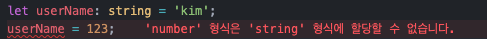
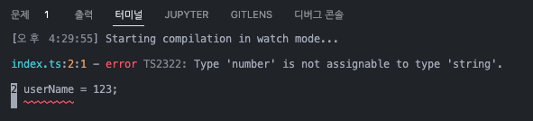

# 타입스크립트 study

타입스크립트 공부하기 2022 10 20 start!

---

# 📌 타입스크립트 설치하기

`npm install -g typescript`

\*맥북의 경우 보안에러가 뜨면 `sudo npm install ~`

웹브라우저는 ts파일을 알아듣지 못해 js파일로 변환 작업을 해야한다.

Terminal에 `tsc -w` 입력해두면 자동으로 ts파일을 js파일로 변환해줌

HTML파일 등에서 타입스크립트로 작성한 코드를 이용하려면
.ts가 아닌 변환된 .js 파일을 사용해야함

`<script src='변환된파일.js'></script>`

**✼ 타입스크립트 사용 시 tscofig.json 파일을 만들어 아래 내용을 작성해야함!**

```json
{
  "compilerOptions": {
    "target": "ES5",
    "module": "commonjs"
  }
}
```

# 📌 React 프로젝트에서 타입스크립트 사용하기

## 이미 있는 React 프로젝트에 설치

`npm install --save typescript @types/node @types/react @types/react-dom @types/jest `

## React 프로젝트를 새로 만들때

`npx create-react-app my-app --template typescript`

---

# 📌 타입스크립트 기본 분법

## 타입스크립트 변수

```ts
let userName: string = 'Kim';
```

변수를 만들 때 타입지정이 가능하다. <br>
변수명: 타입명
타입으로 쓸 수 있는 것들은 string, number, boolean, bigint, null, undefined,[], {} 등이 있다.



 <br>
타입을 지정해 놓으면 타입이 변경될 경우 에러메세지를 띄워준다.

## array, object 자료 타입지정 방법

```ts
let userName: string[] = ['kim', 'park'];
let age: { age: number } = { age: 29 };
```

- `let age : { age : number } = { age : 29 }` 이렇게 작성하면 오브젝트에는 `{ age : number }` 이렇게 생긴 object만 들어올 수 있다.

- `let age : { age? : number } = { age : 29 }` key값 뒤에 ?를 작성하면 age는 옵션으로 되어 age값이 없어도 에러가 발생 안한다.

## Union Type

```ts
let userName: string | number = 'Kim';
```

type을 지정할때 or 기호를 사용하여 다양한 타입을 지정 할 수 있다.

```ts
let userName: string[] | number = 'Kim';
```

이런식으로 스트링이 담긴 array 또는 숫자로 지정 가능

## Type alias

```ts
type UserInfo = string | number;

let userName: UserInfo = 'kim';
```

- 타입을 변수에 저장해 사용할 수 있다.
- `type`명은 대부분 대문자로 작명한다.

```ts
function plus(x: number): number {
  return x + 2;
}
```

- 파라미터와 리턴값에서 타입을 지정할 수 있다.
- 위 함수는 파라미터에 number, retun 값으로 number로 지정한 것
